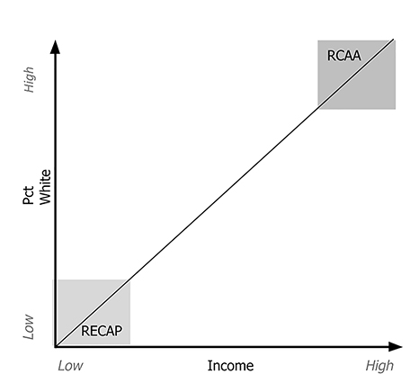

```{r setup, include=FALSE}
knitr::opts_chunk$set(echo = FALSE, cache = TRUE, warning = FALSE, message = FALSE)

if (!require(pacman)) install.packages('pacman')
library(pacman)
p_load(knitr, tidyverse, sf, skimr, mapview, scales, kableExtra, cowplot, janitor)


tract_data <- read_rds("./data/tractdata.rds") %>% 
  mutate(
    dist      = dist*0.000621371, #meters to miles
  )

met_data   <- read_rds("./data/metdata.rds")

# Funs
sum_by <- function(df,groupvar, rd = 2, ...) {
  
  paren <- function (x){paste0("(",x,")")}
  
  groupvar <- enquo(groupvar)
  sumvars <- quos(...)
  
  cnt_grps <- df %>%
    group_by(!!groupvar) %>%
    count()
  
  sum <- df %>%
    group_by(!!groupvar) %>%
    summarise_at(vars(!!!sumvars),funs(mean, sd))
  
  sum <- left_join(cnt_grps, sum)
  
  cnt_tot <- df %>% count()
  
  total <- df %>% 
    select(!!groupvar, !!!sumvars) %>% 
    summarise_if(is.numeric, funs(mean, sd))
  
  
  tab <- bind_rows(sum, total)
  
  tab[NROW(tab),1] <- "Total"
  tab[NROW(tab),2] <- cnt_tot
  
  tab %>% 
    select(sort(current_vars())) %>% 
    select(!!groupvar, n, everything()) %>% 
    mutate_if(is.numeric, round, rd) %>% 
    mutate_at(vars(contains("sd")),funs(paren)) %>% 
    ungroup()
}


zscore <- function(x) {(x-mean(x))/sd(x)}

seg_comp <- function(df,groupvar, collapse_by_group = TRUE, ...) {
  
  sumvars <- quos(...)
  groupvar <- enquo(groupvar)
  
  rcaap_sum <- df %>%
    group_by(METRON, !!groupvar, rc_ap) %>%
    drop_na(rc_ap) %>%
    select(METRON, rc_ap, !!groupvar, !!!sumvars) %>%
    summarise_if(is.numeric, funs(mean), na.rm = T) %>%
    gather(var, value, 4:length(.)) %>%
    unite(var1, rc_ap, var, sep = "_") %>%
    spread(var1, value)
  
  msa_sum <- df %>%
    group_by(METRON) %>%
    select(METRON, !!!sumvars) %>%
    summarise_if(is.numeric, funs(mean), na.rm = T) %>%
    rename_at(vars(2:length(.)), funs(paste0("all_",.)))
  
  df2 <- left_join(msa_sum, rcaap_sum) %>%
    select(METRON, !!groupvar, everything()) %>%
    mutate_if(is.numeric, round, 2) %>%
    ungroup()
  
  if(collapse_by_group){
    cnt_grps <- df2 %>%
      group_by(!!groupvar) %>%
      count()
    
    sum <- df2 %>%
      group_by(!!groupvar) %>%
      summarise_if(is.numeric, funs(mean), na.rm = TRUE)
    
    cnt_tot <- df2 %>% count()
    
    sum <- left_join(cnt_grps, sum)
    

    total <- df2 %>%
      summarise_if(is.numeric, funs(mean), na.rm = TRUE)
    
    total2 <- c(Region= "Total", n = cnt_tot$n, total)
  
    
    tab <- bind_rows(sum, total2) %>%
      select(sort(current_vars())) %>%
      select(Region, n, everything()) %>%
      mutate_if(is.numeric, round, 1) %>%
      ungroup()
    
    tab
    
  } else {
    df2
  }
}

seg_compr <- function(df, groupvar, collapse_by_group = TRUE, ...) {
  
  sumvars <- quos(...)
  
  groupvar <- enquo(groupvar)
  
  
  df2 <- df %>%
    group_by(METRON, !!groupvar) %>%
    select(METRON, rc_ap, !!groupvar,!!!sumvars) %>%
    mutate_if(is.numeric, funs( rt = ./mean(.))) %>% 
    ungroup() %>% 
    group_by(METRON, !!groupvar, rc_ap) %>%
    drop_na(rc_ap) %>% 
    summarise_if(is.numeric, funs(mean), na.rm = TRUE) %>%
    gather(var, value, 4:length(.)) %>%
    unite(var1, rc_ap, var, sep = "_") %>%
    spread(var1, value) %>% 
    select(1:2, contains("_rt")) %>% 
    ungroup()
  
  if(collapse_by_group){
    cnt_grps <- df2 %>%
      group_by(!!groupvar) %>%
      count()
    
    sum <- df2 %>%
      group_by(!!groupvar) %>%
      summarise_if(is.numeric, funs(mean), na.rm = TRUE)
    
    cnt_tot <- df2 %>% count()
    
    sum <- left_join(cnt_grps, sum)
    
        total <- df2 %>%
      summarise_if(is.numeric, funs(mean), na.rm = TRUE)
    
    total2 <- c(Region = "Total", n = cnt_tot$n, total)
  
    
    tab <- bind_rows(sum, total2) %>%
      select(sort(current_vars())) %>%
      select(Region, n, everything()) %>%
      mutate_if(is.numeric, round, 1) %>%
      ungroup()
    
    tab
    
    tab
  } else {
    df2
  }
}
```
# Introduction

Concentrations of poverty combined with racial segregation produce conditions that have been the target of urban and housing policy since the 1980s. Deconcentrating poverty was the objective behind HOPE VI, Moving to Opportunity (MTO), and various HUD initiatives that focused on dispersing subsidized households more widely throughout metropolitan areas. The confluence of race and poverty is the specific target of HUD’s recent regulatory initiative related to Affirmatively Furthering Fair Housing (AFFH). The 2015 AFFH rule requires local governments to study what HUD calls “Racially/Ethnically Concentrated Areas of Poverty” (RECAPs) to inform local efforts to further fair housing goals. The orientation of much recent housing policy during this time period has been to deconcentrate the poor and desegregate people of color, either by facilitating or forcing their movement out of the neighborhoods in which they predominate, or by redevelopment schemes aimed at introducing more upscale housing and higher income residents [@goetzCtW2003]. Countless studies by academics of the dynamics of high-poverty, segregated neighborhoods and the prospects for their improvement have accompanied this strategy [@jargowsky1997poverty; @sharkey2013]. The media, for their part, have produced a steady stream of sensationalized reporting on the “pathologies” of these neighborhoods, especially during the 1980s and 1990s, fueling both academic attention and a policy focus [@sharkey2013].

Curiously, although low-wealth communities of color have been thoroughly problematized and portrayed as the most recognizable example of racial and income segregation in the United States, relatively little attention has been given to the other side of the segregation dynamic—the affluent, White community. Racially Concentrated Areas of Affluence (RCAAs) are not currently referenced in Federal housing policy, nor have they been scrutinized to the extent that RECAPs have. However, patterns of segregation in the United States show that of all racial groups, Whites are the most severely segregated [@feagin2014]. Research also tells us that the segregation of affluence is greater than the segregation of poverty [@feagin2014]. The fact that segregation of the poor and the wealthy is proceeding apace, confirms Sheryll Cashin’s [-@cashin2004failures, p. 185] observation that “the favored quarter, like the Black ghetto, represents an extreme of American separatism.”

Concern about racially concentrated areas of affluence as an expression of problematic separatism is largely absent from our national housing policy agenda and the public imagination more broadly. The continued elision of White neighborhoods of concentrated affluence and social power within normative inquiry reinforces the decades-old tendency to problematize low-income communities of color, while at the same time sparing White neighborhoods and the advantages they embody from examination of any kind. Analyses of segregation that disregard RCAAs understate the degree to which advantage and disadvantage, opportunity and inopportunity, and mobility and immobility are integrally linked. Although our chief objective is not to exhaust the interconnections of these divergent social formations, we see these linked dualities as the normative compass guiding our inquiry into RCAAs. We also see our project as contributing to the growing body of scholarship within the relatively new field of critical whiteness studies. We contribute to this work by empirically exploring not only the “public and psychological wage” that whiteness confers [@du2017black; @roediger1999wages] but also the material. In other words, our concern is how whiteness—particularly in the neighborhood context—confers unearned distributive advantages [@lipsitz2006possessive].

In this article, we examine both racially concentrated poverty and racially concentrated affluence in the largest 50 metropolitan areas in the United States. Our purpose is to shed light on both extremes of residential segregation in American urban areas. Our interest is uncovering the extent of this settlement pattern by mapping the geographic location of these neighborhoods, preliminarily testing hypotheses about the prevalence and nature of RCAAs and assessing the degree to which they correlate with other dimensions of metropolitan growth dynamics (that is, overall segregation indices and economic and demographic characteristics).

In this research, we conceptualize neighborhoods as occupying points in a two-by-two field defined by race and affluence. In exhibit 1, the vertical axis is defined by the racial makeup of neighborhoods, from completely non-White to completely White. The horizontal axis is defined by wealth from least to most affluent. RECAPs occupy the lower left extreme of the plot, whereas RCAAs are the neighborhoods in the upper right. Because of the high correlation between race and income in the United States, we expect that metropolitan areas will present a distribution of neighborhoods that resembles to some degree the relationship depicted in exhibit 1; namely, that as neighborhood income increases, the percentage of residents who are White also increases.

```{r fig1, out.width= "4in", fig.cap="Racially Concentrated Areas of Poverty and Affluence Continuum"}

```

# Racially Concentrated Affluence and Poverty

Residential segregation has long been a defining characteristic of American metropolitan areas and a subject of extensive social science and public policy concern. Although most indicators of racial segregation show modest declines in recent years, segregation remains a central characteristic of many metropolitan areas [@lichter2015toward; @logan2011persistence]. Concentrations of poverty, having abated somewhat during the 1990s, grew again with the turn of the century [@anacker2015kn]. 

The “costs” of segregation have been carefully enumerated by many (for example, Anderson, [-@anderson2010]). For most scholars, the focus has been on widespread and persistent patterns of racial segregation in American communities and how these patterns create and reinforce a range of inequalities. A large body of research has also documented the negative impacts of concentrated poverty on economic and social opportunities and outcomes. Racially concentrated areas of poverty entrench these negative impacts for minority populations and reinforce socio-economic disparities along racial lines. Inequalities in affluence and income are among the most obvious costs of segregation: gaps in wealth and income due to gaps in education and job-readiness from discrimination and differences in educational experiences and benefits of place. Inequalities in housing equity, housing conditions, and lending and availability of credit are related outcomes of residential segregation [@lipsitz2006possessive].

Economic inequalities are not the only costs of high levels of segregation. Exposure to harmful environmental conditions and crime in segregated, low-wealth communities combine with diminished public services to make life more dangerous [@hs2009hs], leading to inequalities in life expectancy between Whites and Blacks and rich and poor [@jackson2000relation; @anderson2010]. Even the access to critical types of social capital is unevenly distributed across communities, leaving residents of low-wealth communities with social networks that are less helpful in achieving upward mobility [-@briggs1998]. Strong patterns of segregation are worrisome because they are “structures of oppression” [@young2002]. Segregation is a “self-reinforcing dynamic” [@galster1999evolving] that exaggerates race and class differences and reinforces discrimination.

Public policy, furthermore, is implicated in the creation and maintenance of spatial inequality in American urban areas, whether it is the role of Federal and local housing programs in producing segregated communities of color, or the impact of local zoning, land use controls, and systems of local public finance in creating and protecting areas of White affluence. Despite this dual complicity, for policymakers (and most social scientists) concerned with addressing problems of segregation, the focus is typically on the conditions and dynamics within segregated communities of color and low-wealth neighborhoods. This focus has produced an overwhelming orientation of public policy toward altering the pattern of residential settlement among people of color and the poor. Our policies have, in fact, placed “no onus on Whites to adjust and contribute to a new multicultural ethos” [@cashin2004failures, p. 81].

Research shows, however, that economic segregation is increasing at both extremes of the wealth distribution [@reardon2014] and that the segregation of Whites in the United States exceeds that of any other racial group [@feagin2014]. Indeed, some of the worried-about “costs” of residential segregation apply to the actions of affluent Whites attempting to isolate from others. As Tilly [-@tilly1998durable] noted, the isolation of low-income communities and people of color occurs against the backdrop of opportunity hoarding, the corralling of resources for the exclusive benefit of already advantaged groups. Just as segregation reinforces the social locations of those already disadvantaged, it too reinforces the tendency of the White and wealthy to legitimate and enclose their advantages for in-group consumption [@anderson2010]. For example, Reardon and Bischoff [-@reardon2014] suggested the erosion of “social empathy” that results from close physical proximity between the middle classes and the poor could enhance the likelihood of “self-interested investments” that serve narrow interests at the expense of more universal social and economic needs. The converse may also be true; support for more universal public goods declines under conditions of segregation. As Anderson [-@anderson2010, p. 61] noted: “Whites favor tax limitations more strongly in more ethnically diverse jurisdictions so they do not have to share their tax contributions with other groups” (see also the findings in Alesina et al., [-@alesina1999]). 

Although Tilly, Anderson, and others refer to this dynamic as opportunity hoarding, we argue that it is better understood as “advantage hoarding.” People who benefit from unjust socio-economic relations and neighborhood exclusivity do not have to actively “seize the opportunity” because neighborhood conditions confer automatic benefits. Advantages such as high and rising property values, quality schools, safety, and so on accrue merely through residence in such neighborhoods.

Hoarding is but one of the many mechanisms that link the divergent trajectories of marginalized neighborhoods on the one hand and exclusive neighborhoods on the other. Some have argued that segregation leads to high levels of land consumption in metropolitan areas, as the White and the wealthy move ever outward to separate themselves from other segments of society [@cashin2004failures]. The willingness of Whites and affluent families to pay for exclusivity increases land and housing costs. Others point to the creation and maintenance of social divisions resulting from segregation; the extreme separation of races leads to greater fear of “the other” by both Blacks and Whites [@feagin2014]. Iris Marion Young [-@young2002] argued that social and political indifference is facilitated “when privileged classes live in separate political jurisdictions” and are thus able to keep resources and insulate themselves from the less fortunate. 

Others point to how race and class segregation work in ways that obscure the privileges of the favored. Again, as Young [-@young2002, p.208] argued, “segregation makes privilege doubly invisible to the privileged” by keeping disadvantage out of sight and normalizing advantage. Anderson [-@anderson2010] noted that racial separation allows the favored group to enjoy advantages without personally discriminating against the disadvantaged. According to the argument, the pursuit of the favored group’s well-being and the enjoyment of the highest quality public and private services are achieved in isolation. All this combines to insulate the favored group and reduce their incentives to support services they do not see or use. This contrasts with suburban Black middle-class neighborhoods, which tend to be more economically diverse [@pattillo2005black], spending more of their tax revenues on redistributive policies at the expense of commercially attractive public investments [@phelan1996race; @anderson2010]. These realities are likely becoming increasingly acute given growing economic inequality in the United States during the past 30 years, which is largely a result of increased income and wealth accumulation of the top end of the income distribution [@saez2013; @shapiro2017].

In recent years, a body of research has grown on the topic of the so-called “super-rich” and what researchers are calling “alpha territories.” Alpha territories are areas of global cities in which the super-rich live and invest [@atkinson2017; @burrows2014life; @forrest2017]. This literature is more an investigation of contemporary capitalism, the behavioral and investment patterns of a global elite, and their impact on cities across the world than it is an examination of residential segregation (for example, Beaverstock, Hubbard, and Short, [-@beaverstock2004]; Pow, [-@pow2011living]; Rich [-@rich2008]; and Hay and Muller, [-@hay2012tiny]). 

Studies focusing on the segregation of affluence include the work of Coulton et al [-@coulton1996] on the relationship between concentrated poverty and concentrated affluence. They found little correlation at the metropolitan level, although they did note that MSAs with higher levels of racial or ethnic segregation also saw high rates of economic segregation. Massey and Eggers  [-@massey1993] also looked at the segregation of affluence and poverty and their spatial isolation from each other. They too found evidence that rates of racial segregation influenced the level of poor-affluent segregation in the 1970s and 1980s. St. John [-@stjohn1999] examined the rate at which affluent households (both Black and White) live in neighborhoods where 50 percent or more of the households are affluent. St. John’s analysis of 335 MSAs using 1990 census data shows that concentrations of affluence were greater in metro areas with economic bases that had more fully experienced restructuring away from durable goods manufacturing and toward global finance and services. The study also shows that greater income inequality and higher absolute levels of income in metropolitan areas were associated with higher rates of concentrated affluence. Like Coulton et al. [-@coulton1996]  and Massey and Eggers [-@massey1993], St. John found that Black/White segregation was related to the concentration of affluence. Lee and Marlay [-@lee2007right] provided a descriptive analysis of affluent neighborhoods in the largest 100 U.S. metropolitan areas that shows that the concept is robust to a range of different measures.
 
These previous studies of concentrated affluence are based on census data from 2000 and earlier. Furthermore, although they suggest that racial segregation and income segregation are related, they do not examine the phenomenon of White affluence directly. Given the meta-analysis by Jackson [-@jackson2000relation] showing that Whites more than Blacks benefit from concentrated affluence, we argue the importance of investigating places of White affluence in the American urban system. In the following analysis, we look at the two extremes of racial and economic segregation in American metropolitan areas: racially/ethnically concentrated areas of poverty (RECAPs) and racially concentrated areas of affluence (RCAAs).

# Methods

## Data and Variables

All data used in our analyses originate from the American Community Survey (ACS) 2012–2016 5-year estimate. We use several variables from the ACS that depict the economic and demographic characteristics of individuals and households and the characteristics of the housing stock. All measures are at the census tract level. Our study covers the largest 50 metropolitan areas in the United States. We summarize our findings on concentrated poverty and affluence by region. We do so for ease of presentation, but also because regions capture important differences in urban development history in the United States, and the evidence shows that patterns of segregation vary significantly by region. Jargowsky  [-@jargowsky1997poverty], for example, showed that concentrations of poverty have varied by region, with the phenomenon growing first in the Midwest and Northeast and then spreading to other areas. Massey and Denton [-@massey1989hs] and Denton [-@denton1994african] demonstrated that rates of segregation and hypersegregation of Blacks and Hispanics have also varied significantly by region, with Northeast and Midwest metropolitan areas scoring highest on most indices of residential segregation.

Defining Racially/Ethnically Concentrated Areas of Poverty (RECAPs). 
We use a well-established set of criteria for identifying RECAPs to define them in our work. According to HUD, a RECAP is a census tract in which more than 40 percent of the residents have incomes less than the Federal poverty level and more than 50 percent of the residents of the census tract are people of color (HUD, 2011). We considered individuals to be people of color if they did not identify themselves as “Not Hispanic or Latino: White Alone.” We could find no theoretical or empirical justification for the racial threshold in the RECAP definition, which appears to be simply an arbitrary level adopted by the Federal government. The justification for the poverty threshold, however, does have an empirical basis. Jargowsky and Bane [-@jargowsky1991ghetto] argued that the 40-percent poverty threshold is confirmed by their field research in metropolitan areas across the country. Neighborhoods that knowledgeable local informants regarded as ghettos, barrios, and slums consistently matched census tracts that had poverty rates of 40 percent or more. Since then, the 40-percent threshold has been widely adopted and has been argued to be the degree of neighborhood poverty above which disadvantage accelerates.


## Defining Racially Concentrated Areas of Affluence (RCAAs)

Our objective in defining RCAAs is to mirror as much as possible the dimensions and methods that constitute the RECAP definition. To think of these phenomena as two ends of the same continuum requires conceptual and operational symmetry. We seek to incorporate four important characteristics of the RECAP definition that into the RCAA definition. First, and most obviously, the neighborhood is defined both by race and by income. Second, to the extent possible, we wish to identify an empirical justification for the race and income thresholds we use (noting as we have previously that the RECAP definition itself fails this standard for race). Third, we seek a definition that is invariant across metropolitan areas. The RECAP definition uses the national poverty level and does not adjust for cost of living across metro areas. It also uses a uniform standard of 50 percent people of color that does not adjust for the degree of racial diversity by metro area. Finally, we seek to mirror the RECAP definition by avoiding a definition that predetermines the prevalence of RCAAs across or within metro areas. This aspect of the definition is reflected in the use of absolute measures of income and race rather than defining these neighborhoods as occupying some percentage of the total distribution of neighborhoods.

We posit that, in the same way neighborhood disadvantage is associated with concentrated poverty and high concentrations of people of color, conversely, distinct advantages are associated with residence in affluent, White communities. We hypothesize that the returns of living in predominantly White and affluent neighborhoods are nonlinear and accelerate at the high end. What we seek in a definition of RCAAs is the combination of the level of whiteness and affluence at the neighborhood scale at which returns accelerate. We use census tract median home value as a proxy for neighborhood advantage. Home values represent a reasonable indicator of neighborhood advantage because they not only capture the quality of the housing stock, they also capture neighborhood characteristics associated with advantages, including good schools, low crime, job proximity, and environmental quality. Finally, and most obviously, they are themselves a form of wealth. 

We conduct nonlinear regression analysis to investigate the impact of percent White and median household income on home values and include a variety of controls associated with neighborhood advantage, including share of adults with a college degree, home ownership rate, and whether the tract was in a central city. We also included a metro area fixed effect to account for systematic differences between metro areas. We operationalize share White as a categorical variable broken into 5 percentage-point increments and interact that variable with median household income. The analysis, summarized in the appendix, describes a non-linear relationship between percent White and home values, with an inflection point estimated at 80 percent (see appendix for details of this step).

Finding a threshold for concentrated affluence using these methods proved more difficult as the model estimated a constant, linear return to household incomes. Without a strong empirical justification for an income threshold, we turn to previous studies of concentrated affluence. Unfortunately, the literature provides no consistent guide for defining the concept. Lee and Marlay [-@lee2007right], for example, operationalized affluent neighborhoods as those in the highest 2 percent in income across the 100 largest metro areas they study. Solari’s [-@solari2012] study of concentrated affluence defines such neighborhoods as the top 10 percent within a metro area’s neighborhood-income distribution. These definitions, however, violate our fourth guideline for a definition of RCAAs and are inconsistent with the methods used to define RECAPs. 

Massey and Eggers used family income of more than \$30,000 in 1979 as the basis of their examination of affluence in the 1970s. This was slightly more than 50 percent above the national family median income in 1979. In his study of concentrated affluence, St. John used a threshold equal to four times the poverty rate. This produced an income level around \$100,000, although St. John used a cost of living index that produced a threshold that varied by metro area (and therefore violates our third guideline and is inconsistent with the methods used to define RECAPs). 

The greatest convergence in previous research on an income level to define affluence puts the threshold at roughly two times the national median. Coulton et al. [-@coulton1996], for example, used a 1990 median family income of over \$75,000, which was just over two times the national median in the 1990 census. They argued that such a standard was consistent with other research on affluence, citing Kosters and Ross [-@kosters1988shrinking] and Blackburn and Bloom [-@blackburn1985h]. 

We adopt a median household income of \$125,000 as our standard. This level is, like Coulton et al., slightly greater than two times the national median in 2016. To achieve our other objective in establishing a definition of RCAA that is symmetrical with that of the RECAP, we use a constant measure of income and do not adjust for cost of living. Thus, our definition of RCAA is a census tract in which 80 percent or more of the population is White and has a median income of at least \$125,000. 

# Analysis

The distribution of census tracts along the two dimensions that define RECAPs and RCAAs is shown for a sample of metro areas in figure 2. Rather than being linear, as depicted theoretically in figure 1, the relationship between percent White and income in census tracts is in fact curvilinear in most metropolitan areas. This is due to one variable, percent White, having an upward limit of 100, whereas the other variable, income, has no upper bound (although is top-coded at \$250,000). The curvilinear form of this relationship is common to most of the metropolitan areas in our sample and is shown in both the Pittsburgh and Salt Lake City plots. In a small number of metro areas, the relationship is not very distinct. As shown for San Jose, the scatterplot is much more diffuse.


```{r fig2, fig.cap="Income and Racial Distribution for sample MSAs(RECAPs/RCAAs Highlighted)"}

pitt <- ggplot(filter(tract_data, mabr == "Pitt"), aes(x = medinc, y=pctw, color = rc_ap)) +
  geom_point(size = 0.5) +
  coord_cartesian(ylim = c(0,100)) +
  scale_x_continuous(breaks = c(50000,100000,150000,200000), labels = c("$50k", "$100k", "$150k", "$200k")) +
  scale_color_discrete(labels = c("RCAA", "RECAP", "Other"), na.value = "black") +
  theme(text = element_text(size=10),
        axis.text.x = element_text(angle=45, hjust=1, size = 6),
        plot.subtitle = element_text(vjust = 1),
        plot.caption = element_text(vjust = 1),
        plot.title = element_text(size = 10)) + 
  labs(x = "Median household income", y = "Percent White", 
    colour = NULL) +
  labs(title = "Pittsburg, PA Metro Area")


sj <- ggplot(filter(tract_data, mabr == "SanJ"), aes(x = medinc, y=pctw, color = rc_ap)) +
  geom_point(size = 0.5) +
  coord_cartesian(ylim = c(0,100)) +
  scale_x_continuous(breaks = c(50000,100000,150000,200000), labels = c("$50k", "$100k", "$150k", "$200k")) +
  scale_color_discrete(breaks = c("RCAA", "RCAP", NA), labels = c("RCAA", "RECAP", "Other"), na.value = "black") +
  theme(text = element_text(size=10),
        axis.text.x = element_text(angle=45, hjust=1, size = 6),
        plot.subtitle = element_text(vjust = 1),
        plot.caption = element_text(vjust = 1),
        plot.title = element_text(size = 10)) + 
  labs(x = "Median household income", y = "Percent White", 
    colour = NULL) +
  labs(title = "San Jose, CA Metro Area")

dc <- ggplot(filter(tract_data, mabr == "Wash"), aes(x = medinc, y=pctw, color = rc_ap)) +
  geom_point(size = 0.5) +
  coord_cartesian(ylim = c(0,100)) +
  scale_x_continuous(breaks = c(50000,100000,150000,200000), labels = c("$50k", "$100k", "$150k", "$200k")) +
  scale_color_discrete(labels = c("RCAA", "RECAP", "Other"), na.value = "black") +
  theme(text = element_text(size=10),
        axis.text.x = element_text(angle=45, hjust=1, size = 6),
        plot.subtitle = element_text(vjust = 1),
        plot.caption = element_text(vjust = 1),
        plot.title = element_text(size = 10)) + 
  labs(x = "Median household income", y = "Percent White", 
    colour = NULL) +
  labs(title = "Washington, DC Metro Area")

slc <- ggplot(filter(tract_data, mabr == "Salt"), aes(x = medinc, y=pctw, color = rc_ap)) +
  geom_point(size = 0.5) +
  coord_cartesian(ylim = c(0,100)) +
  scale_x_continuous(breaks = c(50000,100000,150000,200000),labels = c("$50k", "$100k", "$150k", "$200k")) +
  scale_color_discrete(labels = c("RCAA", "Other"), na.value = "black") +
  theme(text = element_text(size=10),
        axis.text.x = element_text(angle=45, hjust=1, size = 6),
        plot.subtitle = element_text(vjust = 1),
        plot.caption = element_text(vjust = 1),
        plot.title = element_text(size = 10)) + 
  labs(x = "Median household income", y = "Percent White", 
    colour = NULL) +
  labs(title = "Salt Lake City, UT Metro Area")


cowplot::plot_grid(pitt, sj, dc, slc)

```

## Segregation by Race

Table 1 shows the isolation index for Whites and people of color in our 50 metropolitan areas sample. The isolation index measures the degree to which a person of a particular category is surrounded by members of the same group [@massey1989hs]. In 70 percent of the metro areas in our sample, Whites lived in more segregated neighborhoods compared to people of color. Average White isolation in our sample was 25 percent higher than the isolation for people of color. Overall, the typical White person lived in a neighborhood that was 71 percent White, whereas a typical person of color in our sample lived in a neighborhood that was 57 percent people of color. The 10 metro areas with the highest levels of racial isolation of Whites were in the Midwest or Northeast and, not surprisingly given the dynamics of the isolation index, also tended to have larger White populations. Conversely, metro areas with the highest racial isolation for people of color tended to be in the South and West regions and tended to have larger shares of non-White populations.


```{r table1}

tab1 <- sum_by(met_data, Region, rd = 2, iso_w, iso_p)

tab1 <- tab1[,c(1:2,5:6,3:4)] %>% as.matrix()

colnames(tab1) <- c("Region", "N", "mean", "sd", "mean", "sd")

kable(tab1, caption = "Average Metro Area Racial Isolation by Region",
      booktabs = TRUE,
      align=c("l", rep('c', ncol(tab1)-1))) %>% 
  kable_styling() %>% 
  add_header_above(c(" " = 2, "White" = 2, "People of Color" = 2)) %>% 
  row_spec(NROW(tab1), bold = T)


```


Another way to document racial concentrations is to analyze the shares of Whites and people of color that live in racially/ethnically concentrated census tracts. Table 2 shows that in every region, larger percentages of Whites live in majority White tracts compared to the share of people of color who live in majority POC tracts. This pattern holds in the aggregate, but also for 90 percent of the individual metro areas in our sample, greater shares of Whites live in majority White neighborhoods compared to people of color. More than 80 percent of Whites in our sample metro areas live in census tracts that are majority White compared with 60 percent of people of color. 

```{r table2}

tab2 <- sum_by(met_data, Region, rd = 1, shrw_conw50, shrp_conp, shrw_conw)

tab2 <- tab2[,c(1:4,7:8,5:6)]

tab2 %>% 
  kable(caption = "Average Metro Area Racial Concentration by Region ", 
      booktabs = TRUE,
      escape = FALSE,
      align = c("l", rep('c', ncol(tab2)-1)),
      col.names = c("Region", "N", "mean", "sd", "mean", "sd", "mean", "sd")) %>%
  kable_styling() %>%
  add_header_above(c(" " = 2,
                     "Share POC living in\nmajority POC tracts" = 2,
                     "Share of Whites living in\nmajority White tracts" = 2,
                     "Share of Whites in 80+\nWhite tracts" = 2)) %>%
  row_spec(NROW(tab2), bold = T)

```


Table 2 also presents White racial concentration using our more conservative 80-percent threshold. In the average metropolitan area in the Northeast, for example, two-thirds of all Whites live in census tracts in which 80 percent or more of the residents are also White. In contrast, in Western metro areas the average is less than one-fourth of Whites. In 19 of the sample metro areas the share of Whites living in tracts with 80 percent or more Whites is greater than the share of people of color living in tracts with 50 percent or more people of color. 

## Income Concentration

Our analysis shows that 36 percent of metro areas had higher rates of concentrated affluence compared with concentrated poverty. We find 16 percent more areas of concentrated affluence compared to areas of concentrated poverty (2,297 tracts and 1,983 tracts respectively). However, the distribution of concentrated affluence is skewed toward fewer metro areas leading to higher average amounts of concentrated poverty compared to concentrated affluence in our sample. 

```{r table3}
tab3 <- sum_by(met_data, Region, rd = 2, pconaf, pconpv)

tab3 %>% 
  mutate_all(linebreak) %>%
  kable(
      caption = "Average Metro Area Income Concentration by Region", 
      booktabs = TRUE,
      align = c("l", rep('c', ncol(tab3)-1)),
      col.names = c("Region", "N", "mean", "sd", "mean", "sd"))  %>% 
  kable_styling() %>% 
  add_header_above(c(" " = 2,
                     "Share Tracts w/\nCon. Affluence" = 2,
                     "Share Tracts w/\nCon. Poverty" = 2)) %>% 
  row_spec(NROW(tab3), bold = T)
```

Metro areas with the highest rates of concentrated poverty like Memphis, TN, Milwaukee, WI, and Detroit, MI, tended to be in the South and Midwest; metro areas in the Midwest, on average, had the lowest rates of concentrated affluence and the highest rates of concentrated poverty. In contrast, on average, metro areas in the West showed the highest rates of concentrated affluence and the lower rates of concentrated poverty. One metro area, Salt Lake City, UT, had zero areas of concentrated poverty.

# Racially Concentrated Areas of Affluence and Poverty

In the previous section, we analyzed the prevalence and degree of racial or ethnic concentrations and income concentrations separately. In this section, we will directly explore both ends of the income/racial distribution and compare the prevalence and characteristics of RCAAs and RECAPs.  

Table 4 shows the distribution of RCAAs and RECAPs summarized by region. We find that in our sample, RCAAs are more common in the Midwest and Northeast. RECAPs are most common in the Midwest. The West region has, on average, the fewest RCAAs and the fewest RECAPs despite being the most racially diverse region in our sample. 

```{r table4}

tab4 <- sum_by(met_data, Region, rd = 1, prcaaw, prcapp)

colnames(tab4) <- c("Region", "N", "mean", "sd", "mean", "sd")

kable(tab4, 
      caption = "Average Share of Census Tracts that Qualify as RCAA and RECAP by Region",
      booktabs = TRUE,
      align = c("l", rep('c', ncol(tab3)-1))) %>% 
  kable_styling() %>%
  add_header_above(c(" " = 2,
                     "RCAA" = 2,
                     "RECAP" = 2)) %>% 
  row_spec(NROW(tab4), bold = T)
```

Tables 5 and 6 shows the metro areas with the highest rates of RCAAs and RECAPs. Metro areas with high rates of RCAAs tend to be in Whiter metro areas. The list of metro areas with the highest rates of RECAPs is dominated by rustbelt metro areas like Milwaukee, Detroit, Cleveland, and Buffalo. Chicago is the only city that appears on both lists. Salt Lake City was the only metro area that had no RECAP, and Las Vegas was the only metro area in our sample without any RCAA. 

```{r table5}
tab5 <- met_data %>% 
  mutate(rank = rank(-prcaaw)) %>% 
  arrange(rank) %>% 
  filter(rank <=10) %>% 
  select(rank, NAME,rcaa_w, prcaaw) %>% 
  mutate(prcaaw = round(prcaaw,1))

kable(tab5, 
      caption = "Metro Areas w/ Higheset RCAA Concentrations", 
      booktabs = TRUE,
      col.names =  c("Rank", "Metro Name", "N RCAA", "Share of MSA Tracts"),
      align = c("c", "l", "c", "c")) %>% 
  kable_styling()

```

```{r table6}
tab6 <- met_data %>% 
  mutate(rank = rank(-prcapp)) %>% 
  arrange(rank) %>% 
  filter(rank <=10) %>% 
  select(rank, NAME,rcap_p, prcapp) %>% 
  mutate(prcapp = round(prcapp,1))

kable(tab6,
      caption = "Metro Areas w/ Highest RECAP Concentrations",
      booktabs = TRUE,
      col.names =  c("Rank", "Metro Name", "N RECAP", "Share of MSA Tracts"),
      align = c("c", "l", "c", "c")) %>% 
  kable_styling()

```

Table 7 shows the average concentration of White affluent households living in RCAAs and the average concentration of poor POC living in RECAPs. In our 10 Midwestern metro areas, for example, just 7.5 percent of affluent Whites lived in RCAAs. In those same metro areas, 24.8 percent of people of color under the poverty line lived in RECAPs. These regional figures mirror the patterns in exhibit 6. On average, metro areas in the Northeast and the Midwest had the highest shares of affluent Whites living in RCAAs and poor people of color living in RECAPs. The West, while being quite affluent overall, showed the lowest rates of affluent Whites living in areas of concentrated White affluence. Across all metro areas, the rate at which people of color below the poverty line live in RECAPs (15.6) is more than twice the rate at which White affluent households live in RCAAs (6.8).

```{r table7}

tab7 <- sum_by(met_data, Region, rd = 1, shrwa_conwa, shrpp_conpp) %>% 
  as.matrix()
colnames(tab7) <- c("Region", "N", "mean", "sd", "mean", "sd")

kable(tab7, 
      caption = "Concentration of White Affluence and Poor POC in RCAAs and RECAPs", 
      booktabs = TRUE,
      align = c("l", rep("c", ncol(tab7)))) %>% 
  kable_styling() %>% 
  add_header_above(c(" " = 2,
                     "Share Poor POC in RECAP" = 2,
                     "Share White Aff. HH in RCAA" = 2)) %>% 
  row_spec(NROW(tab7), bold = T)
```


## Characteristics of RECAPs and RCAAs

Comparing the income characteristics of RECAPs and RCAAs with the average tract in their respective metro areas, we find that, on average, RCAA tracts have more than twice the median household income of the average tract in their metro area. 

As expected, poverty rates in RCAAs are also significantly lower and are, on average about 20 percent of a typical tract. On average, RCAAs tracts are more income homogenous than RECAPs. The average RCAA in our sample was 57 percent affluent, whereas the average RECAP had a poverty rate of 48 percent. At the same time, RECAPs tended to be larger outliers in terms of poverty rate from their respective metro areas than RCAAs were in terms of affluence. The typical RCAA tract had a rate of affluence 3.2 times that of a typical tract, whereas RECAPs on average had a poverty rate 3.2 times that of a typical tract. The figures presented in table 8 did not vary significantly by region. 

```{r table8}
group_tab <- tract_data %>% 
  group_by(METRON, rc_ap) %>% 
  summarise_at(vars(medinc, pctaff, pctpov), funs(mean)) %>% 
  ungroup() %>% 
  drop_na(rc_ap) %>%
  group_by(rc_ap) %>% 
  summarise_if(is.numeric, mean)

tt <- as_tibble(cbind(nms = names(group_tab), t(group_tab))) 
colnames(tt) <- tt[1,]
tt <- tt[-1,] %>% 
  mutate_at(vars(-1), funs(as.numeric))

all_tab <- tract_data %>% 
  group_by(METRON) %>% 
  summarise_at(vars(medinc, pctaff, pctpov), funs(mean)) %>% 
  ungroup() %>% 
  summarise_if(is.numeric, mean)

att <- as_tibble(cbind(nms = names(all_tab), t(all_tab))) %>% 
  mutate_at(vars(-1), funs(as.numeric)) %>% 
  select(All = V2)

tab8 <- bind_cols(att, tt[,-1]) %>% as.matrix() %>% round(1)

tab8[1,] <- scales::dollar(tab8[1,])

row.names(tab8) <-  c("Median HH Income", "Pct. Affluent", "Pct. Poverty")
colnames(tab8) <- c("All Tract Average", "RCAA Average", "RCAP Average")
kable(tab8, caption = "Average Income Characteristics of RCAAs and RECAPs",
      booktabs = TRUE,
      digits = 2,
      align = c(rep("c", ncol(tab8)))) %>% 
  kable_styling()
```


Table 9 details the racial breakdown of RCAAs and RECAPs and how the racial characteristics compare with typical metro area tracts. By definition, little racial variation occurs within RCAAs; RCAAs look the same across all regions. RECAPs, however, show a much wider range of racial characteristics. In the Midwest and the South, RECAPs are majority Black (65 percent and 59 percent Black, respectively). In the West, Hispanics are the largest racial/ethnic group in RECAPs, and northeastern RECAPs are a mixture.


```{r table9}
group_tab <- tract_data %>% 
  group_by(METRON, rc_ap) %>% 
  summarise_at(vars(pcta, pctb, pcth, pctw), funs(mean)) %>% 
  ungroup() %>% 
  drop_na(rc_ap) %>%
  group_by(rc_ap) %>% 
  summarise_if(is.numeric, mean)

tt <- as_tibble(cbind(nms = names(group_tab), t(group_tab))) 
colnames(tt) <- tt[1,]
tt <- tt[-1,] %>% 
  mutate_at(vars(-1), funs(as.numeric))

all_tab <- tract_data %>% 
  group_by(METRON) %>% 
  summarise_at(vars(pcta, pctb, pcth, pctw), funs(mean)) %>% 
  ungroup() %>% 
  summarise_if(is.numeric, mean)

att <- as_tibble(cbind(nms = names(all_tab), t(all_tab))) %>% 
  mutate_at(vars(-1), funs(as.numeric)) %>% 
  select(All = V2)

tab9 <- bind_cols(att, tt[,-1])
row.names(tab9) <-  c("Pct. Asian", "Pct. Black", "Pct. Hispanic", "Pct. White")
colnames(tab9) <- c("All Tract Average", "RCAA Average", "RCAP Average")
kable(tab9, 
      caption = "Average Racial Characteristics of RCAAs and RECAPs",
      booktabs = TRUE, 
      digits = 1, 
      align=c(rep("c", ncol(tab9)))) %>% 
  kable_styling()

```

## Geography of RCAAs and RECAPs

On average, RCAA tracts are farther from the urban core than the average census tract in a region and much farther away from the core compared to the typical RECAP (see table 10). A typical RCAA in our sample is more than twice as far away from the core as the typical RECAP. RECAPs in our sample were also twice as dense on average as the typical metro area tract and more than four times as dense as the typical RCAA. RCAAs are more likely to be in suburban areas compared to the typical tracts, whereas RECAPs are almost 2.5 times more likely to be in central cities. 

```{r table10}
group_tab <- tract_data %>% 
  group_by(METRON, rc_ap) %>% 
  summarise_at(vars(dist, pop_dens, cc_status), funs(mean), na.rm = T) %>% 
  ungroup() %>% 
  drop_na(rc_ap) %>%
  group_by(rc_ap) %>% 
  summarise_if(is.numeric, mean) %>% 
  mutate(cc_status = cc_status*100)

tt <- as_tibble(cbind(nms = names(group_tab), t(group_tab))) 
colnames(tt) <- tt[1,]
tt <- tt[-1,] %>% 
  mutate_at(vars(-1), funs(as.numeric))

all_tab <- tract_data %>% 
  group_by(METRON) %>% 
  summarise_at(vars(dist, pop_dens, cc_status), funs(mean), na.rm = T) %>% 
  ungroup() %>% 
  summarise_if(is.numeric, mean, na.rm = T) %>% 
  mutate(cc_status = cc_status*100)

att <- as_tibble(cbind(nms = names(all_tab), t(all_tab))) %>% 
  mutate_at(vars(-1), funs(as.numeric)) %>% 
  select(All = V2)

tab10 <- bind_cols(att, tt[,-1]) %>% as.matrix() %>% round(1)

tab10[2,] <- prettyNum(tab10[2,], big.mark = ",")


row.names(tab10) <-  c("Dist. from Core", "Pop Density", "Share located in Central CIty")
colnames(tab10) <- c("All Tract Average", "RCAA Average", "RCAP Average")
kable(tab10, 
      caption = "Distance from Central Business District and Population Density", 
      booktabs = TRUE,
      digits = 1,
      align = c(rep("c", ncol(tab10)))) %>% 
  kable_styling()

```

Some metro areas deviated from this central city/suburban dynamic between RCAAs and RECAPs. Most RECAPs were in suburban areas in the Riverside, CA; Miami, FL; Louisville, KY; and Virginia Beach, VA metro areas. Conversely, some metro areas had most of their RCAAs in the central city including the Los Angeles, CA; Charlotte, NC; New Orleans, LA; Tampa, FL; and Virginia Beach, VA.

Figure 3 maps four representative metro areas and highlights the location of RCAAs and RECAPs. We see a common pattern of RECAPs clustered in central cities, which is consistent with other research [@jargowsky1997poverty]. The “classic” pattern of central city RECAPs and suburban RCAAs is shown in the map of Minneapolis and St. Paul, MN. Los Angeles, in contrast, shows a mix of RCAAs and RECAPs within the central city boundaries. In some metro areas like St. Louis, MO and Chicago, IL, we also observe a directional dividing line between RCAAs and RECAPs consistent with patterns of racial segregation in these metro areas.


```{r fig3, fig.cap= "Mapping RCAAs and RECAPs - From left to right, (A) Chicago, (B) Los Angeles, (C) Minneapolis-St. Paul, (D) St. Louis"}
chi <- ggdraw() + draw_image("./chicago_rcaa.png")
la  <- ggdraw() + draw_image("./la_rcaa.png")
msp <- ggdraw() + draw_image("./msp_rcaa.png")
stl <- ggdraw() + draw_image("./stl_rcaa.png")

plot_grid(chi, la, msp, stl, labels = c("A", "B", "C", "D"), label_size = 8)
```

## Correlation between RCAAs and RECAPs

In the previous section, we analyzed and compared different characteristics of RCAAs and RECAPs compared with the typical neighborhood. In this section, we examine whether the prevalence of RECAPs and RCAAs is correlated. For this preliminary analysis, we began with a scattergram that features the share of metro area tracts that qualify as RCAAs on the x-axis and the share of tracts that qualify as RECAPs on the y-axis (exhibit 13). The lines on the scattergram represent the median values of share RCAA (1.7%) and share RECAP (3.9%) of our sample respectively. One can see much greater variation in the prevalence of RECAPs across metro areas (measured as a percentage of all tracts within a region). The range would seem greater except that the biggest outlier, Memphis, TN, is not pictured in the diagram because it is so out of scale with the rest of the metro areas in our sample. Following Memphis, the Midwestern cities of Milwaukee, WI, Cleveland, OH, and Detroit, MI have the highest percentage of tracts meeting the RECAP definition. Western cities typically rank low in prevalence of RECAPs. The range in the prevalence of RCAAs is much more limited, with Boston, MA standing out with the highest percentage. Cities appearing in the upper right quadrant rank relatively high on both RECAPs and RCAAs.

```{r fig4, fig.cap= "Relationship between RCAAs and RECAPs"}

ggplot(met_data, aes(prcaaw, prcapp, label = mabr, color = Region)) +
  geom_text(size = 3.5) + 
  geom_vline(xintercept = median(met_data$prcaaw), color = "grey") +
  geom_hline(yintercept = median(met_data$prcapp), color = "grey") +
  scale_x_continuous(limits = c(0,15)) +
  scale_y_continuous(limits = c(0,15)) +
  coord_fixed() +
  labs(x = "% RCAA", y = "% RECAP", color = "Region")
```

In table 11, we create a simple typology that places the 50 metro areas in our sample into one of four categories based on whether their share of each neighborhood type is above or below the median value for our sample. This results in four mutually exclusive categories. First, Low/Low metro areas have below the median percentage of RCAAs and RECAPs. High/High metro areas have shares that qualified as RCAAs as well as RECAPs above the median. The off-diagonal categories are metro areas that have high levels of one type of and low levels of the other.


```{r table11}

df <- data.frame(Cat = c("High-RECAP", "Low-RECAP"), 
                 `Low-RCAA` = linebreak(c("Birmingham-Hoover, AL
                 Buffalo, NY
                 Cleveland, OH
                 Indianapolis, IN
                 Jacksonville, FL
                 Las Vegas, NV
                 Memphis, TN
                 Milwaukee, WI
                 New Orleans, LA
                 Oklahoma City, OK
                 Sacramento, CA
                 St. Louis, MO
                 San Antonio, TX", 
                 "Los Angeles, CA
                 Miami, FL
                 Orlando, FL
                 Pittsburgh, PA
                 Providence, MA
                 Riverside-San Bernardino, CA
                 Salt Lake City, UT
                 San Jose, CA
                 Seattle, WA
                 Tampa, FL
                 Virginia Beach, VA")),
                 `High-RCAA` = linebreak(c(
                 "Austin, TX
                 Baltimore, MD
                 Boston, MA
                 Charlotte, NC
                 Denver, CO
                 Louisville, KY
                 Minneapolis-St. Paul, MN
                 Nashville, TN
                 Portland, OR
                 Raleigh, NC
                 Richmond, VA
                 San Diego, CA
                 San Francisco-Oakland, CA
                 Washington, DC",
                 
                 "Atlanta, GA
                 Chicago, IL
                 Columbus, OH
                 Dallas-Fort Worth, TX
                 Detroit, MI
                 Hartford, CT
                 Houston, TX
                 Kansas City, MO
                 New York, NY
                 Philadelphia, PA
                 Phoenix, AZ")))

kable(df, escape = F, caption = "Correlation in Prevalence of RECAPs and RCAAs") %>%
  kable_styling(font_size = 7)


```


We find strong regional trends in this categorization. Most of the metro areas in the High/High category are rust belt metro areas in the Midwest and Northeast. The category includes the largest cities in our sample. New York, Chicago, Houston, Philadelphia, and Phoenix are five of the six most populous central cities in the country and their metro areas are above the median in both RCAAs and RECAPs.  There are no Western cities in the High/High category.


The Low/Low category contains an over-representation of metro areas from the West and no Midwest metro areas at all. In contrast to the pattern of large central cities have high rates of both RCAAs and RECAPs, Los Angeles is in the Low/Low category. These are some of the most racially diverse metro areas in our sample like the Los Angeles, CA MSA, which was only 30 percent White in 2015. 

```{r table12}

tab12 <- met_data %>%
  tabyl(Region, rcapw_type) %>%
  adorn_totals(c("row", "col")) %>% 
  adorn_percentages("row") %>%
  adorn_pct_formatting(digits = 1) %>% 
  adorn_ns()


tab12 %>% 
  kable(caption = "Distance from Central Business District and Population Density", 
      booktabs = TRUE,
      col.names = c("Region", "High-RCAA High-RCAP","High-RCAA Low-RCAP" ,"Low-RCAA High-RCAP","Low-RCAA Low-RCAP", "Total"),
      digits = 1,
      align = c("l", rep("c", ncol(tab12) - 1))) %>% 
  kable_styling() %>% 
  row_spec(NROW(tab12), bold = T) %>% 
  column_spec(2:6, "2.5cm")
```


Metro areas that had low levels of RCAAs and high levels of RECAPs, unsurprisingly tended to be poorer metro areas with larger shares of people of color including Memphis, TN,  and New Orleans, LA. This category also includes metro areas with struggling central cities such as Buffalo, Cleveland, Milwaukee, and St. Louis. Conversely, the high-RCAA/low-RECAP category contains six of the 10 wealthiest metropolitan areas such as San Francisco, Washington, D.C., Boston, and Portland. This category also includes the only Midwestern metro area that registered a low number of RECAPs, Minneapolis-St. Paul. Exhibit 14 lists all metro areas in the four quadrants, and exhibit 15 summarizes the findings by region

## Accounting for Group Size

Measures of concentration like RCAA and RECAP are significantly correlated with group size. That is, the prevalence of RCAAs and RECAPs depend in part on the overall share of people within a metro area who are White and affluent on the one hand, and of color and poor on the other. We found simple bivariate correlations of 0.72 for RCAAs and 0.46 for RECAPs[^2].  As a test of robustness and to better understand the relationship between RCAAs and RECAPs, we performed two OLS regressions to control for the group size of White affluent households and poor people of color using inverse hyperbolic sine transformed variables to increase normality and compared the standardized residuals from each equation. This allowed us to begin to understand how group size affects RCAAs and RECAPs and to chart a more valid analysis of the correlation between these two phenomena. 

[^2]: Variables transformed using an inverse hyperbolic sine transformation to normalize data. We used this rather than a simple log transformation due to the fact that the inverse hyperbolic sine transformation is defined at zero.

The equations for each type of segregation are below:

$$ MetroShareRCAA = \beta_0 + \beta_1ShareMetroWhiteAffluent + \epsilon $$
$$ MetroShareRECAP = \beta_0 + \beta_1ShareMetroPOCPoor + \epsilon $$

```{r include= FALSE}
ihs <- function(x) {log(x + (x^2 + 1)^(1/2))}

mod1 <- lm(ihs(prcaaw) ~ ihs(shr_waff), data = met_data)

mod1_dat <- bind_cols(met_data,fortify(mod1)) %>% 
  rename(shr_waff_resid = .stdresid)

mod2 <- lm(ihs(prcapp) ~ ihs(shr_ppov), data = subset(met_data))

mod2_dat <- bind_cols(met_data,fortify(mod2)) %>% 
  rename(shr_ppov_resid = .stdresid)

comb <- tibble(mabr = met_data$mabr, stdr_rcaa = mod1_dat$shr_waff_resid, stdr_rcap = mod2_dat$shr_ppov_resid, Region = met_data$Region)

#Uncontrolled
cor.test(ihs(met_data$shr_waff), ihs(met_data$prcaaw))
cor.test(ihs(met_data$prcapp), ihs(met_data$shr_ppov))
cor.test(ihs(met_data$prcapp), ihs(met_data$prcaaw))


#Controlled
cor.test(x = comb$stdr_rcaa, y = comb$stdr_rcap)


```

Without controlling for group size, we find little, if any, correlation between metro areas that have high rates of RCAAs and RECAPs (-0.07). After controlling for group size, we find a stronger albeit still moderate positive correlation between metro areas’ shares of RCAAs and RECAPs (0.35, p <0.05).

# Conclusion

The investigation of RCAAs, we argue, is necessary to achieve a fuller understanding of 
inequality and segregation in American metropolitan areas. Although public policy in the United States focuses on and problematizes RECAPs—the confluence of large minority populations and poverty—such concentrations are mirrored by exclusionary enclaves of White affluence. These enclaves represent a second form of extreme segregation in American metropolitan areas.

What is the value added of investigating RCAAs? We suggest four reasons for focusing on RCAAs. In addition to the extensive research that has focused on the damage to one’s life chances from living in an RECAP (that is, the “neighborhood effects” literature), some scholars have focused on the inherent problematic nature of residential segregation and the importance of diversity for well-functioning communities (in both a social and political sense; Anderson, [-@anderson2010]). In this argument, the reality of intense segregation damages the larger polity by making intergroup relations problematic, and by creating and intensifying cross-group hostilities and mistrust. According to this argument, the intense segregation of affluent Whites is as problematic as that of low-income minority families.

Second, RCAAs may themselves exhibit characteristics that have been identified as public policy problems. Our analysis, for example, shows that most RCAAs may contribute significantly to sprawled development; they tend to be distant from metropolitan centers and are often on the periphery of metro areas. Further, RCAAs have a dramatically lower population density than RECAPs and a lower population density than metro areas overall. These land use patterns apply to most suburban development, and no evidence suggests that RCAAs represent more extreme cases of sprawled development, although the question is worth exploring.

Third, RCAAs may represent a public policy issue to the extent that they have been created and maintained through exclusionary and discriminatory land use and development practices. Postwar patterns of suburbanization in many metropolitan areas were characterized by White communities erecting barriers to affordable housing and engaging in racially exclusionary practices [@danielson1976]. Historical analysis of RCAAs could provide clues into how they emerged over time and the politics of their origins.

Finally, in failing to recognize RCAAs, we fail to acknowledge how society remains deeply structured not simply by legacies of White preferential treatment, but by a system that continues to, in fact, reward whiteness. In ignoring RCAAs, we render whiteness normative, treating the unearned benefits it confers as apolitical and natural. Our one-sided problematization of the segregation dynamic does not challenge the public, psychological, and material wage of whiteness, it reinforces it. Through our misrecognition of the problem, we rob ourselves of the very tools necessary for confronting it via policy and action. Without, for example, identifying and investigating RCAAs, it is impossible to determine whether the distribution of public policy benefits within metropolitan areas is fully equitable. For example, it is possible to examine the spatial distribution of public subsidies across a range of policy areas, and to estimate the degree to which Federal and local policies support RCAAs. In a companion paper, for example, we have estimated the volume and value of Federal housing subsidies, including HUD programs, tax expenditures, and tax credit investments going to RCAAs in a single metropolitan area and compare that with the flow of subsidies into RECAP neighborhoods in the region [@goetzRCAA2015]. Although RECAPs are the site of much of the investment in subsidized housing that is funded by the HUD budget, RCAAs are the sites of millions of dollars in tax expenditures for housing, virtually all through the mortgage interest deduction. Preliminary results of this analysis suggest that in the Minneapolis-St. Paul metropolitan area, three times more Federal housing subsidy goes to RCAAs as RECAPs. We estimate that in 2012 RCAAs in the Minneapolis metro received more than \$170 million in Federal housing subsidies, whereas RECAPs received less than \$60 million. As many policy makers seek to reduce disparities between communities of color and Whites, this type of analysis can assist the assessment of equity and efficiency in public investment across both RECAPs and RCAAs.

Our initial analysis of RCAAs in the largest 50 metro areas in the United States allows for a more thorough understanding of the dynamics of wealth and race. The extreme ends of the race/affluence segregation continuum manifest themselves quite differently across regions. RCAAs are more common in some parts of the country and less so in others. The same can be said of RECAPs. The socioeconomics and demographics of RCAAs and RECAPs vary across regions as well, as do the spatial characteristics of these types of neighborhoods. Our analysis has been sufficient to expose such variation but is ill-suited to explain differences across metros. Subsequent investigations need to focus on, among other things, intra-metropolitan variation in the prevalence and characteristics of RCAAs. Future research will also focus on how RCAAs may (or may not) differ from areas that meet one but not both thresholds that define RCAAs. That is, how do RCAAs differ from racially homogeneous neighborhoods without concentrations of affluence, or from affluent neighborhoods that are more racially diverse? This article also supplies only a snapshot of the RCAA phenomenon. Analyses of how RCAAs have developed and evolved over time, and how that evolution is tied to changes in the American political economy, are also overdue.

\newpage

<div id="refs"></div>

\newpage

\clearpage
\pagenumbering{arabic}
\renewcommand*{\thepage}{A\arabic{page}}
\appendix

\section{Appendix}

# RCAA definition

Exhibit A1 shows the estimated marginal effect of an increase in a census tract's share of White residents on the tract's home values. Exhibit A1 illustrates that even after controlling for median household income and other neighborhood characteristics associated with advantage, non-linear returns to living in a Whiter neighborhood exist. We included a metro area fixed effect and an interaction term between race and median household income to allow for a non-linear relationship between race and income.Using an ordinary least squares model, we estimated the following equation:

 $$
\begin{split}
log(MedianValue) = \alpha_i + \beta_1PctWhite + \beta_2log(MedianIncome) + \beta_3 PctWhite \; \times \; log(MedianIncome) + \\ \beta_4PctOwn + \beta_5PctCollege + \beta_6CentCity + \epsilon 
\end{split}
$$


Figure A1 represents the average marginal effect (AME) of race on the expected median home value of a particular census tract. The function is estimated at 5 percentage-point intervals between 0 and 100. The error bars represent the confidence intervals for each estimate. The line represents a Locally Estimated Scatterplot smoothing function (LOESS). 

In order to establish a threshold for a whiteness concentration, we compare the results of two independent procedures. First, we used a distance-based measure to find the point on the curve that is the farthest distance from a hypothetical straight line between the first and last points on the curve. This method yielded an inflection point of 77 percent White. Second, using the R-package “cpr,” we ran an optimization sequence. The routine creates a b-spline regression model with a high number of knots. The algorithm then assesses the relative influence of each knot on the spline function, remove the least influential knot, refit the regression model, reassess the relative influence of each knot, and so forth. We chose the model where root mean square error (RMSE) is minimized (DeWitt et al., 2017). This process identified a knot at 83 percent White. Using these two estimates, we have chosen 80 percent White as a threshold for concentrated whiteness. 


```{r figa1, fig.cap= "Relationship between Neighborhood Percent White and Median Home Value"}
p_load(sjPlot, effects, splines, mgcv)

round_to <- function(x, to = 10) round(x/to)*to

i_ord <- c("(0,50]", "(50,60]", "(60,70]", "(70,80]", "(80,90]", "(90,100]", "(100,250]")
w_ord <- c("(0,5]", "(5,10]", "(10,15]", "(15,20]", "(20,25]", "(25,30]", "(30,35]", "(35,40]", "(40,45]", "(45,50]", "(50,55]", "(55,60]", "(60,65]", "(65,70]", "(70,75]", "(75,80]", "(80,85]", "(85,90]", "(90,95]", "(95,100]")


td <- tract_data  %>%
  mutate(
    ln_inc    = log(medinc),
    ln_val    = log(medval),
    hs_index  = (scale(pctown) + scale(medval))/2,
    w_cat     = cut(pctw,seq(0,100,5)),
    medinck   = round(medinc/1000),
    i_cat     = cut(medinck, c(0,25,50,60,70,80,90,100,150,250)),
    cc_status = factor(cc_status),
    mabr      = factor(mabr),
    w80       = factor(ifelse(pctw > 80, 1, 0))
  ) %>% as_tibble()


mod  <- lm(ln_val ~ w_cat*ln_inc + pctbach + cc_status + pctown + mabr, data = td)

w_eff  <- as_tibble(Effect("w_cat", mod)) %>%
  mutate(w_cat = as.character(w_cat)) %>%
  separate(w_cat, into = c("low", "high"), sep = ",", remove = F) %>% 
  mutate(low = as.numeric(gsub("[^0-9]", "", low)),
         high = as.numeric(gsub("[^0-9]", "", high)),
         mid  = (low + high)/2,
         w_cat = as_factor(w_cat, levels =w_cat, ordered = T))

wb <- ggplot(w_eff, aes(x = high, y = fit)) +
  geom_point() +
  geom_smooth(se = FALSE) +
  geom_errorbar(aes(ymin = lower, ymax = upper)) +
  labs(x = "Tract % White", y = "Estimated Home Value(Log Scale)")

wb
```


Code for inflection point analysis available on [github](https://github.com/tdamiano).

```{r include = F}
#"Elbow method

x <- w_eff$mid
y <- w_eff$fit

dat <- tibble(x,y)

new_line <- cbind(x = seq(min(x), max(x), length.out = 100), 
                  y = seq(min(y), max(y), length.out = 100))

sf_dat <- st_as_sf(dat, coords = c("x", "y"))

new_line <- st_linestring(new_line)

dat$dist <- st_distance(sf_dat, new_line)

max(dat$dist)
ggplot(dat, aes(x = x, y = dist)) +
  geom_point()

dat$x[which.max(dat$dist)]
```

```{r include = FALSE}

# CPR Method (please allow some time for this to run)

p_load(cpr)

initial_cp <- cp(fit ~ bsplines(mid, df = 20), data = w_eff)
cpr_run    <- cpr(initial_cp)
plot(cpr_run, color = TRUE)
plot(cpr_run, type = 'rmse', to = 10)
selected_cp <- cpr_run[[10]]
selected_cp
  
plot(selected_cp)
```